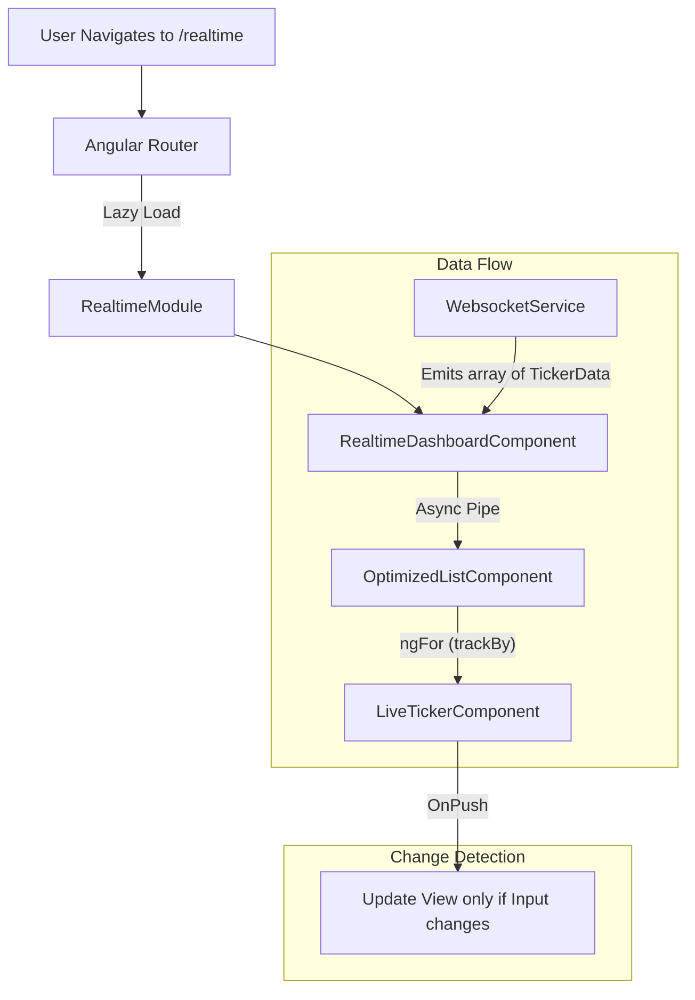

# Realtime Module Architecture & Flow

This document explains how the `feature/realtime` module works, demonstrating high-performance Angular patterns.

## Architecture Overview

The module is designed to handle high-frequency data updates efficiently.

## Key Concepts Explained

### 1. Lazy Loading
**File:** [app-routing.module.ts](file:///home/artem/test/day_10/src/app/app-routing.module.ts)
- The entire module is loaded **only** when the user visits `/realtime`.
- This reduces the initial load time of the application (main bundle size).
- **Code:** `loadChildren: () => import(...).then(m => m.RealtimeModule)`

### 2. Real-Time Data Stream (Simulated WebSocket)
**File:** [websocket.service.ts](file:///home/artem/test/day_10/src/app/feature/realtime/services/websocket.service.ts)
- We use RxJS `interval(1000)` to simulate a WebSocket pushing data every second.
- **`shareReplay(1)`**: Ensures that multiple subscribers (if any) get the latest emitted value immediately without restarting the stream.

### 3. Container vs. Presentational Components
- **Container ([RealtimeDashboardComponent](file:///home/artem/test/day_10/src/app/feature/realtime/components/realtime-dashboard/realtime-dashboard.component.ts#5-27))**: 
    - Smart component.
    - Connects to the service.
    - Passes data down via `async` pipe.
- **Presentational ([OptimizedListComponent](file:///home/artem/test/day_10/src/app/feature/realtime/components/optimized-list/optimized-list.component.ts#4-22), [LiveTickerComponent](file:///home/artem/test/day_10/src/app/feature/realtime/components/live-ticker/live-ticker.component.ts#10-51))**: 
    - Dumb components.
    - Receive data via `@Input()`.
    - Focus purely on rendering.

### 4. Performance Optimizations

#### OnPush Change Detection
**File:** [live-ticker.component.ts](file:///home/artem/test/day_10/src/app/feature/realtime/components/live-ticker/live-ticker.component.ts)
- **`ChangeDetectionStrategy.OnPush`**: Tells Angular, "Don't check me unless my `@Input` reference changes."
- Since we emit a *new* array every second from the service, the inputs update, and the component re-renders.
- If we mutated the array in place, `OnPush` would *not* detect changes (which is good—it forces immutable data patterns).

#### TrackBy Function
**File:** [optimized-list.component.ts](file:///home/artem/test/day_10/src/app/feature/realtime/components/optimized-list/optimized-list.component.ts)
- **Problem**: `*ngFor` normally destroys and recreates DOM elements if the object reference changes.
- **Solution**: `trackBy: trackBySymbol` tells Angular to identify items by their unique ID (`symbol`).
- **Result**: If 'AAPL' was in index 0 and is still in index 0, Angular reuses the existing DOM element and just updates the text bindings, saving processing power.

## Step-by-Step Flow

1.  **Initialization**: User clicks "Realtime". Angular downloads `realtime-module.js`.
2.  **Subscription**: [RealtimeDashboardComponent](file:///home/artem/test/day_10/src/app/feature/realtime/components/realtime-dashboard/realtime-dashboard.component.ts#5-27) initializes and subscribes to `WebsocketService.ticker$` using the `| async` pipe in the template.
3.  **Data Emission**: Every 1 second, [WebsocketService](file:///home/artem/test/day_10/src/app/feature/realtime/services/websocket.service.ts#10-33) creates a new array of random stock data.
4.  **Propagation**: 
    - The `async` pipe pushes the new array to [OptimizedListComponent](file:///home/artem/test/day_10/src/app/feature/realtime/components/optimized-list/optimized-list.component.ts#4-22).
    - [OptimizedListComponent](file:///home/artem/test/day_10/src/app/feature/realtime/components/optimized-list/optimized-list.component.ts#4-22) uses `*ngFor` with [trackBy](file:///home/artem/test/day_10/src/app/feature/realtime/components/optimized-list/optimized-list.component.ts#18-21) to render [LiveTickerComponent](file:///home/artem/test/day_10/src/app/feature/realtime/components/live-ticker/live-ticker.component.ts#10-51)s.
5.  **Rendering**: 
    - [LiveTickerComponent](file:///home/artem/test/day_10/src/app/feature/realtime/components/live-ticker/live-ticker.component.ts#10-51) (OnPush) detects the new Input.
    - It compares the current price with the previous (if logic existed) or simply renders the new price.
    - Visual cues (green/red text) are applied based on the data.
